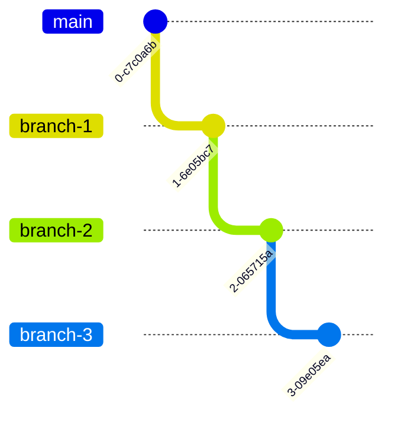

# Stacking

## What is stacking?

A **stack** is a series of branches that build on each other.

If your trunk branch is `main`, a stack might look like this:



In the above setup:

- `branch-1` is stacked on `main`
- `branch-2` is stacked on `branch-1`
- `branch-3` is stacked on `branch-2`

## Why use the `gt` CLI for stacks

The `gt` CLI is especially good when:

- one feature naturally breaks into several reviewable parts
- you want reviewers to see a clean sequence instead of one huge pull request
- you need to keep working while lower branches are still under review
- your stack needs regular restacking as trunk moves

### Create a branch

Use `gt create` when you have a change ready to become its own branch.

### Modify a branch

Use `gt modify` when you want to keep working on the current branch.

That might mean:

- amending the existing branch
- adding another commit
- updating a downstack branch and restacking the branches above it

### Submit pull requests

Use `gt submit` to push your branches and turn them into pull requests.

For stacked work, people often use:

```bash
gt submit --stack
```

### Sync with trunk

Use `gt sync` to update your local view of trunk, clean up merged work, and restack what still needs to land.

This is one of the most useful commands in the CLI. It keeps your stack from drifting too far from reality.

## Move around a stack

Once you have a stack, navigation matters. The `gt` CLI gives you stack-aware movement commands instead of forcing you to remember every branch name.

Useful commands:

- `gt up` moves to the child branch
- `gt down` moves to the parent branch
- `gt top` jumps to the top of the current stack
- `gt bottom` jumps to the branch closest to trunk
- `gt checkout --stack` narrows branch selection to the current stack
- `gt log` shows the stack shape

## Restack when trunk moves

Stacks are great until trunk changes under you. Then they need maintenance.

Use:

- `gt restack` — rebases each branch in the current stack onto its updated parent.
- `gt sync` — syncs all branches with remote, prompts to delete branches for merged or closed PRs, restacks what can be restacked without conflicts, and overwrites trunk with the remote version if it can't be fast-forwarded.

## Reshape a stack

Not every stack comes out clean on the first try. Sometimes a branch is too big. Sometimes two branches should really be one. Sometimes the order is wrong.

The `gt` CLI has commands for that too.

### Split a branch

Use `gt split` when one branch should become several smaller ones.

### Fold a branch

Use `gt fold` when a branch should disappear into its parent.

### Reorder or move branches

Use `gt move` or `gt reorder` when the dependency structure needs to change.

### Squash or absorb changes

Use `gt squash` or `gt absorb` when you want to clean up history inside a stack.

`gt absorb` is especially nice for staged hunks that clearly belong to an earlier branch. It can place changes into the right commit downstack and then restack the branches above it.

## Delete, pop, track, and untrack

- `gt delete` removes a tracked branch and restacks children onto the parent
- `gt pop` removes the branch but keeps the work in your working tree
- `gt track` adopts an existing branch into tracked stack metadata
- `gt untrack` removes tracking from a branch

## Git still works

The `gt` CLI does not try to banish Git. In a lot of places, it just passes commands through.

- use `gt` for stack-aware operations
- keep using Git-style commands for inspection and normal staging

## Worktrees and advanced setups

The `gt` CLI supports Git worktrees, but this is still an advanced workflow. If a branch is checked out in another worktree, some commands will avoid modifying it or will force you to be more explicit.

If your team uses worktrees heavily, treat them as supported, but still a place where you should move a little more carefully.

Starting in `gt` version `1.8.4`, `gt` does not modify branches checked out in another worktree in most cases.
